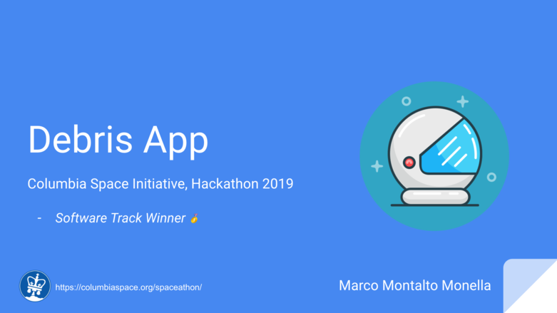

# Columbia Space Initiative Hackathon (2019)

## Software Track Challenge

Satellites are said to be in LEO if they have a maximum altitude of less than 1,200 statute miles, or if they orbit the Earth at most every 128 minutes. The vast majority of artificial satellites are in LEO. Satellites in these orbits are used for earth observation, intelligence gathering, communications, various kinds of science, and crewed spaceflight. Various kinds of “space junk”, like upper stages, payload fairings, and debris from spaceflights, is also in LEO.
The vast majority of satellites, once placed in orbit, do not contain propulsion systems. As a result, satellites that have completed their missions or failed on orbit are generally left in space until their orbit decays (the air resistance even in orbit will create drag on the satellite and eventually cause the satellite to reenter). However, this process can take years, and satellite operators do not generally have control over their spacecraft’s orbit or orientation during this time. This makes the LEO region space more crowded and more dangerous for following generations of satellites, and ultimately places the ability of humanity to access and act in this region of space. A primary purpose of this hackathon is to seek out new ways of addressing the problem of debris in LEO, both for satellites currently in space, and satellites that have yet to launch.

---

The primary objective of the software track is to seek out creative solutions to the LEO debris problem through novel software applications, utilities, or simulations. 
Software solutions should consider looking for inspiration at the technologies of NewSpace companies, such as LeoLabs, and Analytical Graphics Incorporated. The US government also provides a Space Situational Awareness (SSA) service through the US Air Force. The judges are looking for commercially viable, creative software ideas that will clear LEO of debris and make it a less risky place to operate.

---

On Sunday, if you submit your software hack for judging, you will have a 7-minute window to “demo” your solution to the judging panel, followed by a 5-minute Q&A with the panel. How you use this time and what materials you use in the presentation is up to you. We recommend a brief PowerPoint, accompanied a demo or handout of no more than 2 pages in length.

## Proposed Idea

Webpage showing possible number of collisions given a lat-long if shooting an object up into space straight. It could later be improved using a trajectory vector & a forecast trajectory for the debris.

### Presentation Slides

Click [**here**](docs/DebrisApp.pdf) to see the slide presentation deck.

### Steps (and challenges)

1. Explore API. ✅
2. Mock data. ✅
3. Convert from ECI to LLA (and viceversa). [MathWorks example](https://www.mathworks.com/help/aerotbx/ug/lla2eci.html) 🔲
4. Build front-end. 🔲
    1. Accept current location manually or automatically from device. 🔲
    2. Show 3D embeddable map from LeoLabs ([doc](https://platform.leolabs.space/documentation/embeddable_map)). 🔲
    3. Show disabled vector direction (or get it from device gyroscope). 🔲
    4. Accept input for size of launched object. 🔲
    5. Show message: "Your rocket might going to be hit by X debris! Buckle up! Hope your shield is powerful enough!" 🔲

## References

- Columbia Space Initiative Hackathon website: [https://columbiaspace.org/spaceathon/](https://columbiaspace.org/spaceathon/)
- LeoLabs Platform Official website: [https://platform.leolabs.space](https://platform.leolabs.space)
- Expo: [https://expo.io/](https://expo.io/)

Thanks to the [@columbiaspace](https://github.com/columbiaspace) team for the nice experience!

